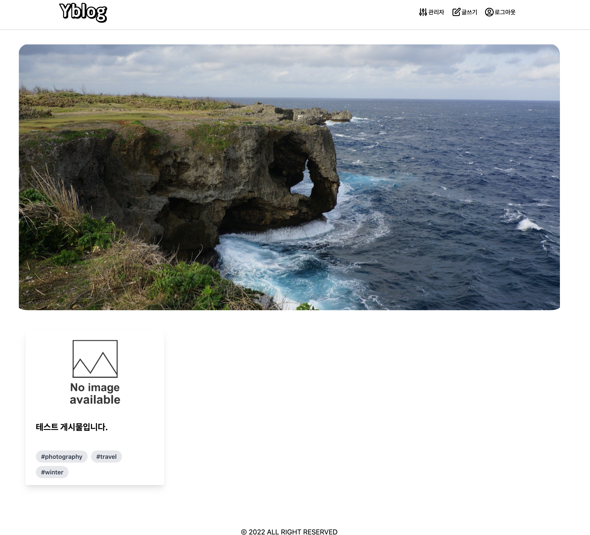
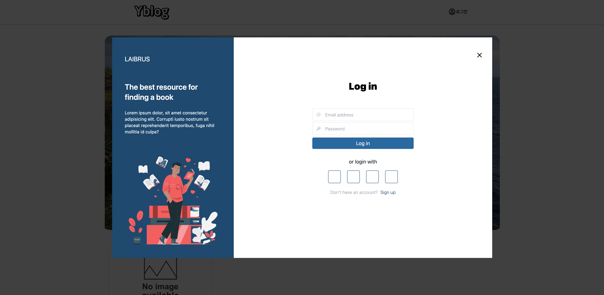
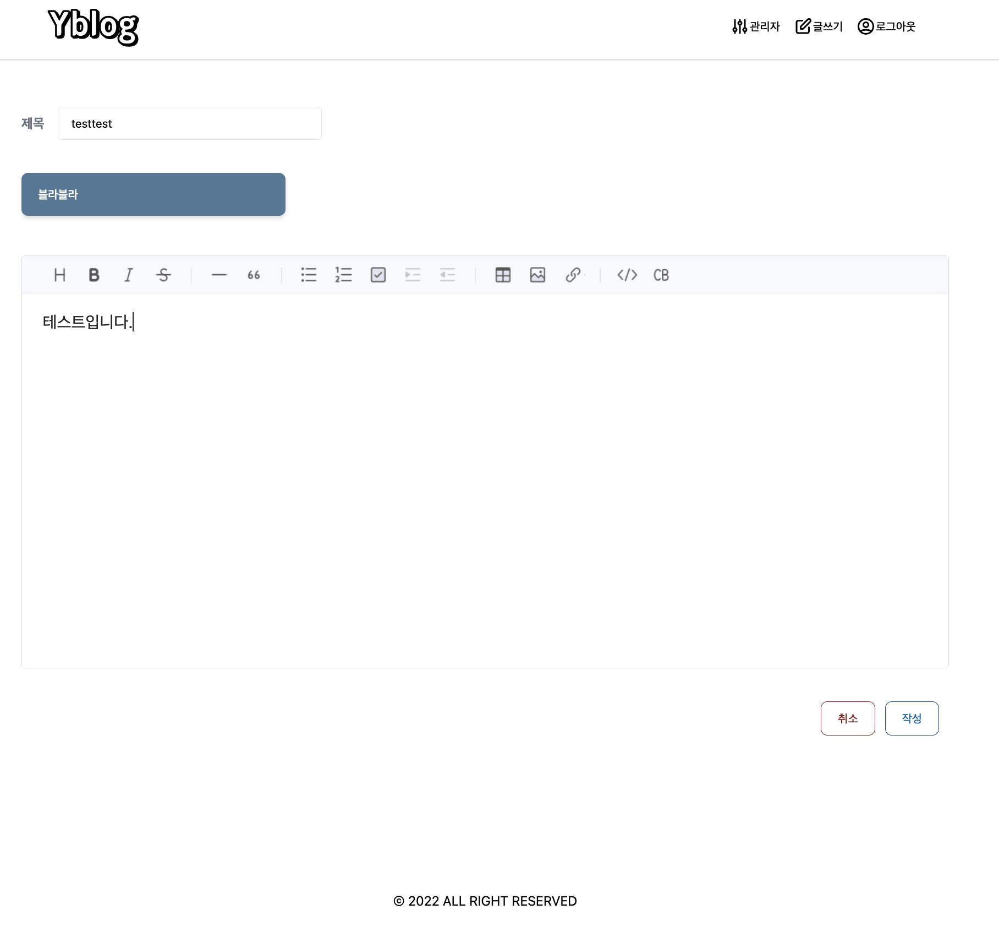

# yblog 프로젝트

## 소개
- velog를 참고하여 나만의 서비스를 만들어보고자 기획 및 개발
- jwt를 이용한 로그인 서비스
- 게시글 쓰기 기능 구현

## 사용기술

### BackEnd
- NodeJS , MongoDB

### FrontEnd
- Javascript , TypeScript , React , HTML/CSS , tailwindCSS

### Etc 
- AWS EC2 , S3 , CloudFront 
- Nginx 
- Jenkins
  
## 화면 

